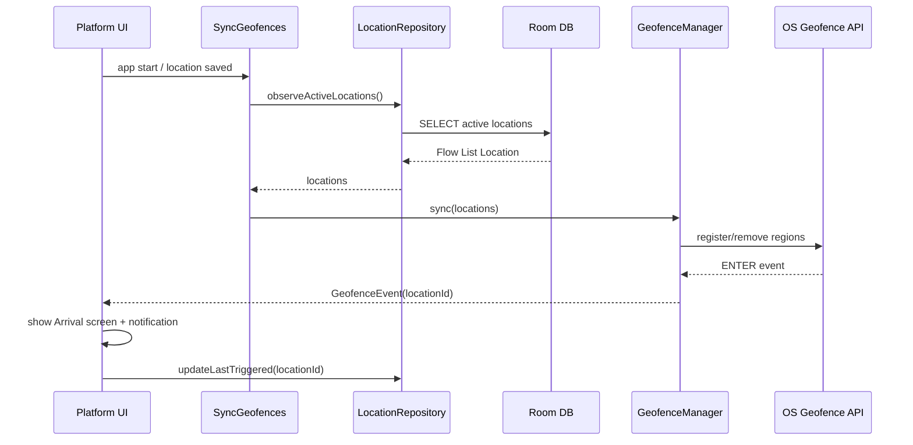
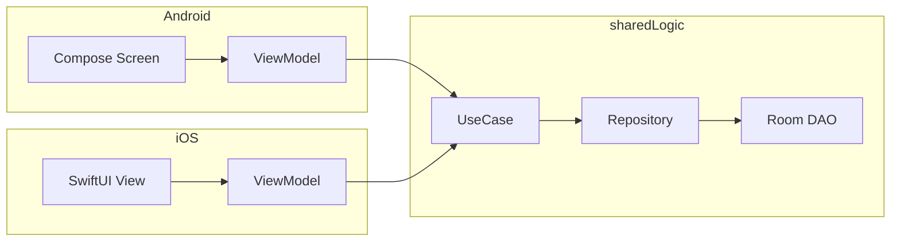

# Moventiq — Application Architecture

> **Local-only MVP** · Android Jetpack Compose · iOS SwiftUI · Room 3 (KMP) · shared Kotlin business logic

This document defines the target architecture for implementation. Visual specs live in `pencil-new.pen` / `DESIGN.md`. Product scope lives in `MVP.md`.

---

## 1. Principles

| Principle | Decision |
|---|---|
| Data | **Room 3** in `:sharedLogic` — single schema, Android + iOS |
| Business logic | **Kotlin Multiplatform** — repositories, use cases, geofence API |
| Android UI | **Jetpack Compose** + Material 3 in `:androidApp` |
| iOS UI | **SwiftUI** in `:iosApp` |
| Identity | **No profile, no auth** — device-local DB only |
| State | Unidirectional — UI observes repositories / use cases |
| Design tokens | Map `DESIGN.md` → platform themes (Compose `MoventiqTheme`, SwiftUI `MoventiqTheme`) |

**Retire `:sharedUI` (Compose Multiplatform)** once native screens land. It was a bootstrap; MVP ships native UIs per platform.

---

## 2. Module topology

```
┌─────────────────────────────────────────────────────────────────┐
│                        :androidApp                              │
│  Compose UI · Navigation · Android ViewModels · Hilt · GMS    │
└────────────────────────────┬────────────────────────────────────┘
                             │ depends on
┌────────────────────────────▼────────────────────────────────────┐
│                        :sharedLogic                             │
│  Domain · UseCases · Repositories · Room DB · expect/actual      │
│  (commonMain + androidMain + iosMain)                           │
└────────────────────────────┬────────────────────────────────────┘
                             │ exported as SharedLogic.framework
┌────────────────────────────▼────────────────────────────────────┐
│                         :iosApp                                 │
│  SwiftUI · NavigationStack · @Observable VMs · CoreLocation     │
└─────────────────────────────────────────────────────────────────┘
```

| Module | Gradle / Xcode | Responsibility |
|---|---|---|
| `:sharedLogic` | KMP library → `SharedLogic.framework` | Room, repos, use cases, geofencing contract |
| `:androidApp` | Android application | Compose screens, Android services, DI root |
| `:iosApp` | Xcode project | SwiftUI screens, iOS services, links framework |
| `:sharedUI` | *(deprecated)* | Remove after Android Compose migration |

---

## 3. Layer model (sharedLogic)

```
┌──────────────────────────────────────────────────────────┐
│  presentation (platform)                                  │
│  Android: Screen + ViewModel    iOS: View + ViewModel     │
└─────────────────────────┬────────────────────────────────┘
                          │ calls
┌─────────────────────────▼────────────────────────────────┐
│  domain                                                   │
│  Location · Task · Settings · GeofenceEvent (pure models) │
│  UseCases: CreateTask, SyncGeofences, OnArrival, …        │
└─────────────────────────┬────────────────────────────────┘
                          │ uses
┌─────────────────────────▼────────────────────────────────┐
│  data                                                     │
│  LocationRepository · TaskRepository · SettingsStore    │
│  Room DAOs · Entity mappers · GeofenceManager (expect)    │
└──────────────────────────────────────────────────────────┘
```

**Dependency rule:** domain never imports Room or platform APIs. Data implements repository interfaces defined in domain.

---

## 4. Package layout — `:sharedLogic`

```
com.mohamedfaridelsherbini.moventiq/
├── domain/
│   model/           Location, Task, Priority, ReminderType, AppSettings
│   repository/      LocationRepository, TaskRepository, SettingsRepository (interfaces)
│   usecase/
│       location/    CreateLocation, UpdateLocation, DeleteLocation, ObserveLocations
│       task/        CreateTask, CompleteTask, ObserveTasksByLocation, ObserveAllTasksGrouped
│       geofence/    SyncGeofences, HandleGeofenceEnter
│       settings/    UpdateSettings, ObserveSettings, ClearAllData
│   util/            Result, AppError
├── data/
│   local/
│       entity/      LocationEntity, TaskEntity, SettingsEntity
│       dao/         LocationDao, TaskDao, SettingsDao
│       MoventiqDatabase.kt
│       Converters.kt          // Instant, enums
│   mapper/          LocationMapper, TaskMapper
│   repository/      LocationRepositoryImpl, TaskRepositoryImpl, …
│   settings/        DataStore or Room-backed SettingsRepositoryImpl
├── platform/
│   GeofenceManager.kt         // expect
│   NotificationScheduler.kt   // expect
│   PermissionState.kt         // expect (optional)
└── di/
    SharedLogicModule.kt       // Koin module or factory for KMP
```

### androidMain additions
```
platform/
  GeofenceManager.android.kt    // GeofencingClient + BroadcastReceiver
  NotificationScheduler.android.kt
  DatabaseBuilder.android.kt    // Room.databaseBuilder(context, …)
```

### iosMain additions
```
platform/
  GeofenceManager.ios.kt        // CLLocationManager region monitoring
  NotificationScheduler.ios.kt  // UNUserNotificationCenter
  DatabaseBuilder.ios.kt        // Room + BundledSQLiteDriver
```

---

## 5. Room 3 database

Single database **`moventiq.db`**, version 1, owned by `:sharedLogic`.

### Dependencies (add to `gradle/libs.versions.toml`)

```toml
[versions]
room = "2.7.0"          # Room KMP (Room 3 track via androidx.room)
sqlite = "2.5.0"

[libraries]
androidx-room-runtime = { module = "androidx.room:room-runtime", version.ref = "room" }
androidx-room-compiler = { module = "androidx.room:room-compiler", version.ref = "room" }
androidx-sqlite-bundled = { module = "androidx.sqlite:sqlite-bundled", version.ref = "sqlite" }
```

Apply `ksp(libs.androidx.room.compiler)` on `:sharedLogic` for both targets.

### Schema

```kotlin
// ── locations ──
@Entity(tableName = "locations")
data class LocationEntity(
    @PrimaryKey val id: String,           // UUID
    val name: String,
    val address: String?,
    val latitude: Double,
    val longitude: Double,
    val radiusMeters: Int,                 // default 200
    val icon: String,                      // "house", "briefcase", …
    @ColumnInfo(name = "is_active") val isActive: Boolean,
    @ColumnInfo(name = "created_at") val createdAt: Long,      // epoch millis
    @ColumnInfo(name = "last_triggered_at") val lastTriggeredAt: Long?,
)

// ── tasks ──
@Entity(
    tableName = "tasks",
    foreignKeys = [ForeignKey(
        entity = LocationEntity::class,
        parentColumns = ["id"],
        childColumns = ["location_id"],
        onDelete = ForeignKey.SET_NULL,
    )],
    indices = [Index("location_id"), Index("is_completed")],
)
data class TaskEntity(
    @PrimaryKey val id: String,
    val title: String,
    val notes: String?,
    @ColumnInfo(name = "location_id") val locationId: String?,
    val priority: String,                    // NONE | LOW | MEDIUM | HIGH
    @ColumnInfo(name = "due_at") val dueAt: Long?,
    @ColumnInfo(name = "reminder_type") val reminderType: String,  // ON_ARRIVAL | TIME | NONE
    @ColumnInfo(name = "is_completed") val isCompleted: Boolean,
    @ColumnInfo(name = "sort_order") val sortOrder: Int,
    @ColumnInfo(name = "created_at") val createdAt: Long,
    @ColumnInfo(name = "completed_at") val completedAt: Long?,
)

// ── settings (single row, id = "app") ──
@Entity(tableName = "settings")
data class SettingsEntity(
    @PrimaryKey val id: String = "app",
    val theme: String,                     // SYSTEM | LIGHT | DARK
    val arrivalAlerts: Boolean,
    val taskReminders: Boolean,
    val vibration: Boolean,
    val quietHoursEnabled: Boolean,
    @ColumnInfo(name = "quiet_start_minutes") val quietStartMinutes: Int,  // 22*60
    @ColumnInfo(name = "quiet_end_minutes") val quietEndMinutes: Int,        // 7*60
    @ColumnInfo(name = "default_radius_meters") val defaultRadiusMeters: Int,
    @ColumnInfo(name = "default_priority") val defaultPriority: String,
    @ColumnInfo(name = "default_reminder") val defaultReminder: String,
    @ColumnInfo(name = "auto_complete_on_leave") val autoCompleteOnLeave: Boolean,
)
```

### DAOs (Flow-first)

```kotlin
@Dao
interface LocationDao {
    @Query("SELECT * FROM locations ORDER BY name")
    fun observeAll(): Flow<List<LocationEntity>>

    @Query("SELECT * FROM locations WHERE id = :id")
    fun observeById(id: String): Flow<LocationEntity?>

    @Query("SELECT * FROM locations WHERE is_active = 1")
    fun observeActive(): Flow<List<LocationEntity>>

    @Insert(onConflict = REPLACE)
    suspend fun upsert(entity: LocationEntity)

    @Query("DELETE FROM locations WHERE id = :id")
    suspend fun deleteById(id: String)

    @Query("UPDATE locations SET last_triggered_at = :at WHERE id = :id")
    suspend fun updateLastTriggered(id: String, at: Long)
}

@Dao
interface TaskDao {
    @Query("SELECT * FROM tasks WHERE location_id = :locationId AND is_completed = 0 ORDER BY sort_order")
    fun observeActiveForLocation(locationId: String): Flow<List<TaskEntity>>

    @Query("SELECT * FROM tasks WHERE is_completed = 0 ORDER BY sort_order")
    fun observeAllActive(): Flow<List<TaskEntity>>

    @Query("SELECT * FROM tasks WHERE id = :id")
    fun observeById(id: String): Flow<TaskEntity?>

    @Insert(onConflict = REPLACE)
    suspend fun upsert(entity: TaskEntity)

    @Query("DELETE FROM tasks WHERE id = :id")
    suspend fun deleteById(id: String)

    @Query("DELETE FROM tasks WHERE location_id = :locationId")
    suspend fun deleteByLocationId(locationId: String)

    @Query("UPDATE tasks SET is_completed = 1, completed_at = :at WHERE id = :id")
    suspend fun markComplete(id: String, at: Long)
}

@Dao
interface SettingsDao {
    @Query("SELECT * FROM settings WHERE id = 'app'")
    fun observe(): Flow<SettingsEntity?>

    @Insert(onConflict = REPLACE)
    suspend fun upsert(entity: SettingsEntity)
}
```

### Database builder (platform actual)

```kotlin
// commonMain
@Database(entities = [LocationEntity::class, TaskEntity::class, SettingsEntity::class], version = 1)
@TypeConverters(Converters::class)
abstract class MoventiqDatabase : RoomDatabase() {
    abstract fun locationDao(): LocationDao
    abstract fun taskDao(): TaskDao
    abstract fun settingsDao(): SettingsDao
}

expect fun createDatabase(): MoventiqDatabase

// androidMain — DatabaseBuilder.android.kt
actual fun createDatabase(): MoventiqDatabase =
    Room.databaseBuilder(context, MoventiqDatabase::class.java, "moventiq.db").build()

// iosMain — BundledSQLiteDriver
actual fun createDatabase(): MoventiqDatabase {
    val driver = BundledSQLiteDriver()
    return Room.databaseBuilder<MoventiqDatabase>(
        name = DATABASE_PATH,
        factory = { MoventiqDatabase::class.instantiateImpl() }
    ).setDriver(driver).build()
}
```

Geofences are **not** stored in Room — they are derived from active `LocationEntity` rows and registered with the OS via `GeofenceManager`.

---

## 6. Android — Jetpack Compose

### Package layout (`:androidApp`)

```
com.mohamedfaridelsherbini.moventiq/
├── MoventiqApplication.kt
├── MainActivity.kt
├── di/                          Hilt modules
├── navigation/
│   MoventiqNavHost.kt
│   Routes.kt
│   BottomBar.kt                 // matches Component/TabBar
├── ui/
│   theme/                       MoventiqTheme, Color, Type, Shape (from DESIGN.md)
│   components/                  TaskRow, LocationCard, ActiveLocationCard, …
│   splash/
│   onboarding/
│   permission/
│   home/
│   tasks/                       AllTasksScreen, TaskDetailScreen, …
│   locations/
│   arrival/
│   settings/
│   search/
├── service/
│   GeofenceBroadcastReceiver.kt
│   BootReceiver.kt
└── notification/
    ArrivalNotificationManager.kt
```

### Stack

| Concern | Library |
|---|---|
| UI | Compose BOM / Material 3 |
| Navigation | Navigation Compose (`NavHost` + typed routes) |
| ViewModel | `androidx.lifecycle:lifecycle-viewmodel-compose` |
| DI | Hilt (Android) + Koin or manual factory bridging `sharedLogic` |
| Maps | Google Maps Compose (Create/Edit Location) |
| Geofencing | Play Services Location |
| Permissions | Accompanist Permissions or `ActivityResultContracts` |
| Coroutines | `lifecycle-runtime-compose` collects `Flow` from repos |

### Screen pattern

```kotlin
@Composable
fun HomeScreen(
    viewModel: HomeViewModel = hiltViewModel(),
) {
    val state by viewModel.state.collectAsStateWithLifecycle()
    HomeContent(state = state, onEvent = viewModel::onEvent)
}

@HiltViewModel
class HomeViewModel @Inject constructor(
    private val observeLocations: ObserveActiveLocations,
    private val observeTasks: ObserveAllActiveTasks,
    private val geofenceEvents: GeofenceManager,
) : ViewModel() {
    private val _state = MutableStateFlow(HomeUiState())
    val state: StateFlow<HomeUiState> = _state.asStateFlow()

    fun onEvent(event: HomeEvent) { /* … */ }
}
```

ViewModels live in `:androidApp` (platform UI layer). They call **use cases** from `:sharedLogic`, never DAOs directly.

### Navigation graph

```
splash → onboarding? → locationPermission → notificationPermission? → main
main (Scaffold + BottomBar):
  home
  tasks (+ taskDetail/{id}, createTask, editTask/{id}, searchTasks)
  places (+ createLocation, editLocation/{id}, locationTasks/{id}, searchPlaces)
  settings (+ notifications, geofencing, appearance, privacy, about)
arrival (full-screen overlay / separate destination on geofence event)
```

---

## 7. iOS — SwiftUI

### Folder layout (`iosApp/iosApp/`)

```
App/
  MoventiqApp.swift              @main, DI bootstrap
  AppDependencies.swift          wires SharedLogic factories
Navigation/
  RootView.swift
  MainTabView.swift              // Home · Tasks · + · Places · Settings
Features/
  Home/
    HomeView.swift
    HomeViewModel.swift
  Tasks/
  Locations/
  Settings/
  Arrival/
  Onboarding/
UI/
  Theme/
    MoventiqTheme.swift           // colors from DESIGN.md
    MoventiqTypography.swift
  Components/
    TaskRowView.swift
    LocationCardView.swift
    MoventiqBottomBar.swift
Platform/
  GeofenceService.swift           // wraps Kotlin GeofenceManager or native CL
  NotificationService.swift
  LocationPermissionService.swift
Bridge/
  SharedLogic+Async.swift         // Flow → AsyncStream helpers (SKIE or hand-rolled)
```

### Stack

| Concern | Framework |
|---|---|
| UI | SwiftUI (iOS 17+) |
| Navigation | `NavigationStack` + `NavigationPath` |
| State | `@Observable` ViewModels (Observation framework) |
| DB | **SharedLogic.framework** (Room via KMP) |
| Geofencing | CoreLocation (`CLCircularRegion`) |
| Notifications | UserNotifications |
| Maps | MapKit (`Map`, `Marker`, circle overlay for radius) |

### ViewModel pattern

```swift
@Observable
final class HomeViewModel {
    private(set) var state = HomeUiState()

    private let observeLocations: ObserveActiveLocations
    private var tasks: Task<Void, Never>?

    init(observeLocations: ObserveActiveLocations) {
        self.observeLocations = observeLocations
    }

    func start() {
        tasks = Task {
            for await locations in observeLocations.invoke().asyncStream() {
                await MainActor.run { state.locations = locations }
            }
        }
    }
}
```

Swift ViewModels call Kotlin **use cases** exported through `SharedLogic`. Use [SKIE](https://skie.touchlab.co/) or `AsyncStream` wrappers for `Flow` interop.

### Tab structure (matches design)

Same five destinations as Android — implement `MoventiqBottomBar` to match `Component/TabBar` in `pencil-new.pen`.

---

## 8. Geofencing flow (cross-platform)



| Platform | Implementation |
|---|---|
| Android | `GeofencingClient`, `PendingIntent`, `BroadcastReceiver`, `BOOT_COMPLETED` |
| iOS | `CLLocationManager.startMonitoring(for:)`, delegate callbacks, background modes |

---

## 9. Data flow (UI → DB)



**Reads:** DAO `Flow` → Repository maps Entity → Domain → UseCase → ViewModel → UI.

**Writes:** UI event → ViewModel → UseCase → Repository → DAO suspend → optional `SyncGeofences`.

---

## 10. DI bootstrap

### Android (Hilt)

```kotlin
@HiltAndroidApp
class MoventiqApplication : Application() {
    lateinit var sharedLogic: SharedLogicComponent
}

@Module @InstallIn(SingletonComponent::class)
object SharedLogicModule {
    @Provides @Singleton
    fun provideDatabase(@ApplicationContext ctx: Context): MoventiqDatabase =
        Room.databaseBuilder(ctx, MoventiqDatabase::class.java, "moventiq.db").build()
}
```

### iOS

```swift
@main
struct MoventiqApp: App {
    let deps = AppDependencies()  // calls SharedLogicFactory.shared.createDatabase()

    var body: some Scene {
        WindowGroup {
            RootView(deps: deps)
        }
    }
}
```

Expose a `SharedLogicFactory` object from Kotlin (`sharedLogic/di/`) that iOS and Android both use to construct repositories and use cases.

---

## 11. Design system mapping

| Design (`.pen` / `DESIGN.md`) | Android Compose | SwiftUI |
|---|---|---|
| `$primary` `#4F46E5` | `MoventiqColors.primary` | `Color.moventiqPrimary` |
| `$bg` / `$card` | `MaterialTheme` + custom | `Background` / `Card` styles |
| Plus Jakarta Sans | `FontFamily` via downloadable font | Custom font in bundle |
| `Component/TabBar` | `MoventiqBottomBar()` | `MoventiqBottomBar` |
| `Component/TaskRow` | `TaskRow()` | `TaskRowView` |
| `Component/LocationCard` | `LocationCard()` | `LocationCardView` |
| Light / dark | `MoventiqTheme(darkTheme)` | `@Environment(\.colorScheme)` + override |

Each screen in `pencil-new.pen` maps 1:1 to a Compose `@Composable` and a SwiftUI `View`.

---

## 12. Migration from current repo

| Step | Action |
|---|---|
| M0 | Add Room 3 + schema to `:sharedLogic`; implement repositories & use cases |
| M1 | Build Android theme + components in `:androidApp/ui` |
| M2 | Implement Android screens (MVP order: Home → Places → Tasks → Settings) |
| M3 | Android geofencing + notifications |
| M4 | Build SwiftUI theme + components; link `SharedLogic.framework` |
| M5 | Implement iOS screens + CoreLocation geofencing |
| M6 | Remove `:sharedUI` module and update `settings.gradle.kts` |

Update `MVP.md` §3 platform table when `:sharedUI` is removed.

---

## 13. Testing strategy

| Layer | Android | iOS | sharedLogic |
|---|---|---|---|
| DAO | `room-testing` in `androidHostTest` | In-memory Room in `iosTest` | — |
| Repository | `androidHostTest` | `iosTest` | `commonTest` (fakes) |
| UseCase | — | — | `commonTest` |
| UI | Compose UI tests | XCTest + ViewInspector (optional) | — |

---

## 14. File checklist (M1 deliverables)

**sharedLogic**
- [ ] `MoventiqDatabase`, entities, DAOs, mappers
- [ ] `LocationRepository`, `TaskRepository`, `SettingsRepository`
- [ ] Core use cases (CRUD + observe)
- [ ] `GeofenceManager` expect/actual stubs
- [ ] `SharedLogicFactory`

**androidApp**
- [ ] `MoventiqTheme` + core components
- [ ] `MoventiqNavHost` + `MainActivity`
- [ ] Home, Locations, Tasks, Settings screens

**iosApp**
- [ ] `MoventiqTheme` + core components
- [ ] `MainTabView` + navigation
- [ ] Home, Locations, Tasks, Settings views
- [ ] SharedLogic Flow bridge

---

## Related docs

- [MVP.md](MVP.md) — scope, screens, data model
- [AGENT.md](AGENT.md) — agent conventions (update module table to reference this doc)
- [DESIGN.md](DESIGN.md) — tokens and brand
