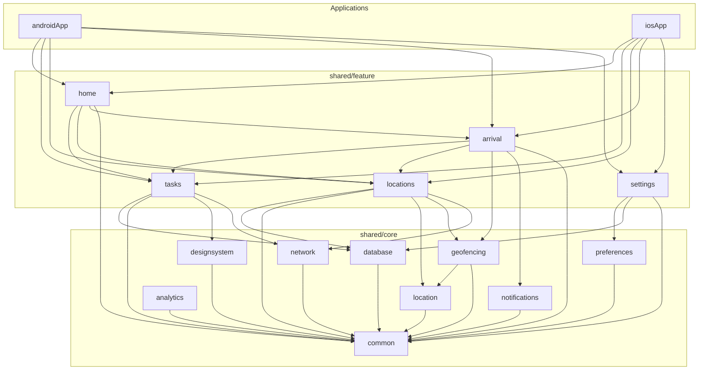
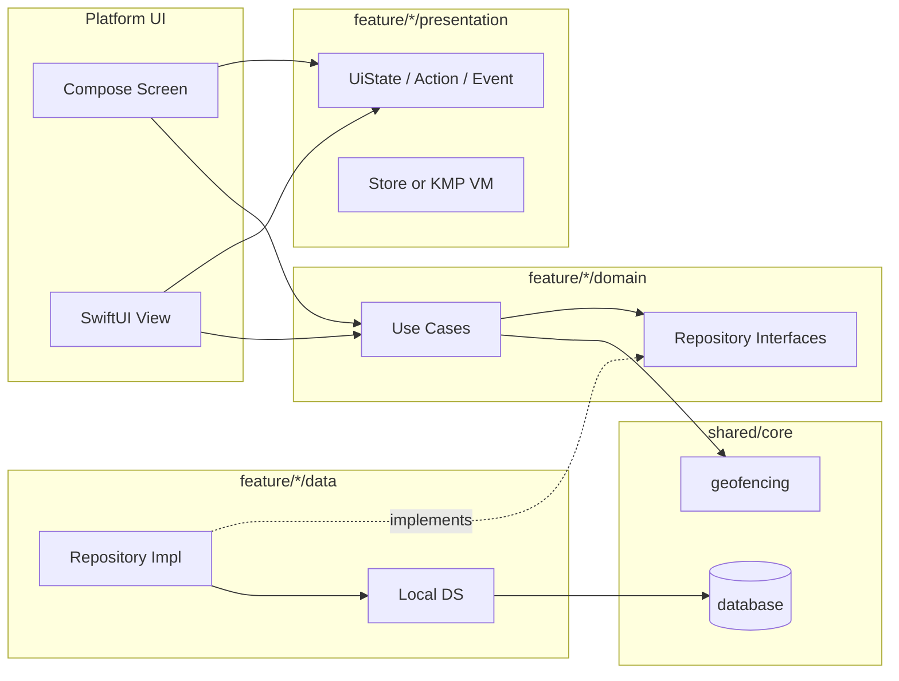
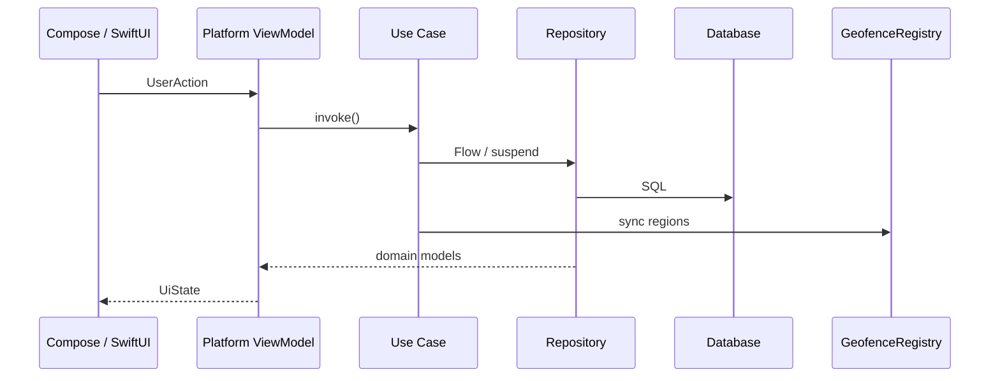

# Moventiq — Application Architecture

> **Location-aware productivity** · Android Jetpack Compose · iOS SwiftUI · Kotlin Multiplatform · offline-first · feature-first modules

Visual specs: `Moventiq.pen` / `DESIGN.md`. Product scope: `MVP.md`. Agent conventions: `AGENT.md`.

**Koin (KMP):** [Kotlin Multiplatform setup](https://insert-koin.io/docs/reference/koin-core/kmp-setup/) · [RESOURCES.md](RESOURCES.md)

---

## 1. Principles

| Principle | Decision |
|---|---|
| Organization | **Feature-first** Gradle modules — not monolithic `domain/` / `data/` packages |
| Business logic | **Kotlin shared** — use cases, repositories, state models in `shared/feature/*` |
| UI | **100% native** — Compose (`:androidApp`), SwiftUI (`:iosApp`) |
| Shared presentation | **State only** — `UiState`, `Action`, `Event`; optional KMP store; **no** Compose/SwiftUI in shared |
| Data (MVP) | **Room 3** in `core/database` (today: interim `:sharedLogic`) |
| Data (scale) | **SQLDelight** in `core/database` when splitting modules |
| Network | **Ktor** in `core/network` — **deferred** until sync/collaboration (MVP is local-only) |
| DI | **Koin** — per-feature modules + app bootstrap |
| Identity | **No profile, no auth** — device-local only ([MVP.md](MVP.md)) |
| Cross-feature | Domain events or shared read models — **no** feature→feature `data` dependencies |

**Retire `:sharedUI`** — deprecated Compose Multiplatform bootstrap; do not add UI there.

---

## 2. Current vs target modules

| Phase | Gradle modules | Notes |
|---|---|---|
| **Now** | `:androidApp`, `:iosApp`, `:sharedLogic`, `:sharedUI` (deprecated) | Splash + Koin bootstrap in `sharedLogic/di` |
| **Target** | `:androidApp`, `:iosApp`, `shared/core/*`, `shared/feature/*` | Split `sharedLogic` incrementally |

```
Moventiq/
├── shared/
│   ├── core/          common, network, database, preferences, location,
│   │                  geofencing, notifications, analytics, designsystem
│   ├── feature/       home, tasks, locations, arrival, settings
│   └── platform/      optional Koin aggregators (android / ios)
├── androidApp/
├── iosApp/
└── (future) wearApp/, widgetExt/, webApp/
```

---

## 3. Module dependency diagram



### Dependency rules (enforce in CI)

1. **Acyclic** module graph.
2. `feature/*/domain` — zero imports from `data`, SQLDelight/Room, Ktor, platform APIs.
3. `feature/*/data` — implements domain repos; may use `core/database`; must not import another feature’s `data`.
4. `feature/*/presentation` — domain + use cases only (no DAOs).
5. `core/*` — never depends on `feature/*`.
6. **Apps** — UI + navigation + platform ViewModels; no business rules.
7. **Features never depend on each other’s `data`** — use `domain` interfaces or `core/common` events.

---

## 4. Feature module layout

Each `shared/feature/<name>/` is a KMP library:

```
shared/feature/tasks/
└── src/
    ├── commonMain/kotlin/.../feature/tasks/
    │   ├── domain/
    │   │   ├── model/
    │   │   ├── repository/
    │   │   └── usecase/
    │   ├── data/
    │   │   ├── local/
    │   │   ├── remote/          # future (Ktor)
    │   │   ├── mapper/
    │   │   └── repository/
    │   ├── presentation/
    │   │   ├── state/
    │   │   ├── action/
    │   │   ├── event/
    │   │   └── viewmodel/       # optional KMP store
    │   └── di/
    │       └── TasksModule.kt
    ├── androidMain/             # only if feature needs Android-specific data
    └── iosMain/
```

| Feature | Responsibility |
|---|---|
| `home` | Dashboard, aggregates, insight chip |
| `tasks` | Task CRUD, reorder, complete, link to location |
| `locations` | Place CRUD, radius, active flag, triggers geofence sync |
| `arrival` | Geofence ENTER handling, arrival session, notification payload |
| `settings` | Appearance, notifications prefs, privacy, clear all data |

---

## 5. Core modules

```
shared/core/common/         Result, AppError, dispatchers, clocks, DomainEventBus
shared/core/network/        Ktor client (future — calendar, teams, web)
shared/core/database/       Room (MVP) → SQLDelight (target), drivers, migrations
shared/core/preferences/    theme, quiet hours, notification toggles
shared/core/location/       GeoCoordinate, LocationProvider, PermissionGateway (expect)
shared/core/geofencing/     GeofenceRegistry, GeofenceEventSource, sync policy (expect)
shared/core/notifications/  NotificationScheduler, channels (expect)
shared/core/analytics/      AnalyticsTracker (no-op in MVP)
shared/core/designsystem/   numeric tokens from DESIGN.md (not UI widgets)
```

### Geofencing ownership

```
feature/locations  → persist place + radius → request sync
core/geofencing    → register OS regions, Flow<GeofenceEvent>, cap policy
feature/arrival    → on ENTER: load tasks, UiState, schedule notification
androidApp/iosApp  → receivers / delegates, deep links to Arrival route
```

### Notifications ownership

| Layer | Role |
|---|---|
| `core/notifications` | OS channels, schedule/cancel, permission |
| `feature/arrival` | **What** to show on ENTER |
| `feature/settings` | User toggles, quiet hours |
| Platform apps | Icons, tap → navigation |

---

## 6. Layer model (within a feature)



**Reads:** DAO/`Flow` → repository → domain → use case → platform ViewModel → UI.

**Writes:** UI → ViewModel → use case → repository → DAO → optional `SyncGeofences`.

---

## 7. Android — `:androidApp`

```
androidApp/src/main/kotlin/com/mohamedfaridelsherbini/moventiq/
├── MoventiqApplication.kt
├── MainActivity.kt
├── navigation/              MoventiqNavHost, Routes, effects
├── screens/                 splash, home, tasks, locations, arrival, settings, onboarding
├── components/              TaskRow, LocationCard, MoventiqBottomBar
├── theme/                   MoventiqTheme (DESIGN.md tokens)
└── di/                      appModule (ViewModels), FeatureModules.kt
```

| Concern | Library |
|---|---|
| UI | Compose + Material 3 |
| Navigation | Navigation Compose |
| ViewModel | `lifecycle-viewmodel-compose` |
| DI | Koin (`koin-android`, `koin-compose-viewmodel`) |
| Geofencing | Play Services Location (`:androidApp` receiver + `core/geofencing`) |

ViewModels live in **`androidApp`**. They call **shared use cases**, never DAOs.

### Navigation graph

```
splash → onboarding? → locationPermission → notificationPermission? → main
main (Scaffold + BottomBar): home | tasks | places | settings
arrival (full-screen on geofence ENTER)
```

---

## 8. iOS — `:iosApp`

```
iosApp/iosApp/
├── App/                     MoventiqApp, AppDependencies
├── Navigation/              RootView, MainTabView
├── Screens/                 Home, Tasks, Locations, Arrival, Settings, Splash
├── Components/
├── Theme/
├── DI/                      thin — graph in SharedLogic.framework
└── Bridge/                  SharedLogic+Async.swift (Flow → AsyncStream)
```

| Concern | Framework |
|---|---|
| UI | SwiftUI (iOS 17+) |
| Navigation | `NavigationStack` |
| State | `@Observable` ViewModels |
| Logic | `SharedLogic.framework` (KMP) |
| Bootstrap | `KoinInitIosKt.doInitKoinIos()` |

Swift ViewModels call Kotlin **use cases** from `AppDependencies` / Koin.

---

## 9. Platform interaction with shared code



**Android:** `initKoin { androidContext(); modules(appModule, *featureModules) }`

**iOS:** `AppDependencies.bootstrap()` → `KoinInitIosKt.doInitKoinIos()`

---

## 10. Technology stack

| Area | MVP (now) | Target (scale) |
|---|---|---|
| Shared language | Kotlin Multiplatform | same |
| Async | Coroutines, Flow | same |
| DI | Koin 4.x | same |
| Serialization | kotlinx.serialization | same |
| Persistence | Room 3 (`:sharedLogic` → `core/database`) | SQLDelight optional migration |
| HTTP | — | Ktor in `core/network` |
| Android UI | Jetpack Compose, Material 3, Navigation Compose | + Wear, widgets |
| iOS UI | SwiftUI, NavigationStack | + watchOS |

---

## 11. DI (Koin)

Per [Koin KMP setup](https://insert-koin.io/docs/reference/koin-core/kmp-setup/):

```kotlin
// shared/core/... + shared/feature/*/di/
expect val platformModule: Module

fun initKoin(config: KoinAppDeclaration? = null): KoinApplication = startKoin {
    modules(coreModules, platformModule, *featureModules)
    config?.invoke(this)
}
```

```kotlin
// androidApp — MoventiqApplication
initKoin {
    androidContext(this@MoventiqApplication)
    modules(appModule) // ViewModels only
}
```

```swift
// iosApp — AppDependencies.swift
KoinInitIosKt.doInitKoinIos()
```

**Interim:** `sharedLogic/di/KoinModules.kt`, `PlatformModule.android.kt`, `PlatformModule.ios.kt`.

---

## 12. Testing strategy

| Layer | Location | Tooling |
|---|---|---|
| Use cases | `feature/*/commonTest` | kotlin-test, fakes |
| Repositories | `feature/*/commonTest` + host tests | in-memory DB |
| SQL / Room | `core/database` | migration + query tests |
| Geofence policy | `core/geofencing/commonTest` | fake registry |
| Shared store | `feature/*/presentation` | Turbine |
| Android UI | `androidApp/androidTest` | Compose Test, test doubles |
| iOS UI | `iosAppUITests` | XCUITest, launch args |

```bash
./gradlew :sharedLogic:testAndroidHostTest :sharedLogic:iosSimulatorArm64Test
./gradlew :androidApp:testDebugUnitTest
./gradlew :androidApp:pixel6Api36DebugAndroidTest \
  -Pandroid.testInstrumentationRunnerArguments.package=com.mohamedfaridelsherbini.moventiq.ui.splash
cd iosApp && xcodebuild test -project iosApp.xcodeproj -scheme iosApp \
  -destination 'platform=iOS Simulator,name=iPhone 17 Pro,OS=latest' CODE_SIGNING_ALLOWED=NO
```

No Koin in **unit** tests — construct use cases with fakes.

---

## 13. Future scale map

| Capability | Placement |
|---|---|
| Widgets / Wear OS | `androidApp` flavor or `wearApp/` → same feature use cases |
| Apple Watch | watchOS target → `feature/arrival`, `feature/tasks` |
| AI suggestions | `feature/insights` or `core/ai` |
| Calendar sync | `core/network` + `feature/integrations/calendar` |
| Team collaboration | `core/network` + `feature/team` + auth in `core/common` |
| Web | `sharedJs` / WASM + reuse `domain`/`data` |

New surfaces are **apps** depending on **features**, not duplicated logic.

---

## 14. Migration plan (from `:sharedLogic` monolith)

| Step | Action |
|---|---|
| M0 | Theme, components, nav scaffold (`androidApp`, `iosApp`) |
| M1 | `core/database` schema + `feature/tasks`, `feature/locations`, `feature/settings` repos (can stay in `:sharedLogic` packages first) |
| M2 | CRUD UI wired to use cases |
| M3 | `core/geofencing` + `core/notifications` + `feature/arrival` |
| M4 | Polish, onboarding, a11y |
| M5 | iOS parity |
| M6 | Extract Gradle modules under `shared/`; remove `:sharedUI` |
| Post-MVP | `core/network` (Ktor), SQLDelight migration if needed |

**Package migration inside `:sharedLogic`:** move code to `feature/<name>/domain|data` packages before splitting Gradle modules.

---

## 15. Design system mapping

| Design (`DESIGN.md`) | Android | iOS |
|---|---|---|
| Tokens | `MoventiqTheme` + `LocalMoventiqColors` | `MoventiqTheme` |
| TabBar | `MoventiqBottomBar` | `MoventiqBottomBar` |
| TaskRow | `TaskRow` | `TaskRowView` |
| LocationCard | `LocationCard` | `LocationCardView` |

Numeric tokens: `core/designsystem` + platform themes.

---

## Appendix A — Room 3 schema (MVP)

Single database **`moventiq.db`**, version 1. Owned by data layer (`core/database`; interim `:sharedLogic`).

Geofences are **not** stored in Room — derived from active locations + `GeofenceRegistry`.

### Entities (summary)

- **locations** — id, name, address, lat/lng, radiusMeters, icon, isActive, createdAt, lastTriggeredAt
- **tasks** — id, title, notes, locationId (FK), priority, dueAt, reminderType, isCompleted, sortOrder, timestamps
- **settings** — single row `id = "app"` — theme, notification prefs, quiet hours, defaults

Full entity definitions, DAO signatures, and `createDatabase()` expect/actual: see git history or implement per `moventiq-room-kmp` skill when landing M1.

### Gradle (version catalog)

```toml
room = "2.7.0"
sqlite = "2.5.0"
koin = "4.0.3"
```

Apply `ksp(libs.androidx.room.compiler)` on the database module.

---

## Related docs

- [MVP.md](MVP.md) — scope, screens, milestones
- [AGENT.md](AGENT.md) — conventions, commands
- [DESIGN.md](DESIGN.md) — tokens
- [RESOURCES.md](RESOURCES.md) — Koin KMP and other external references
