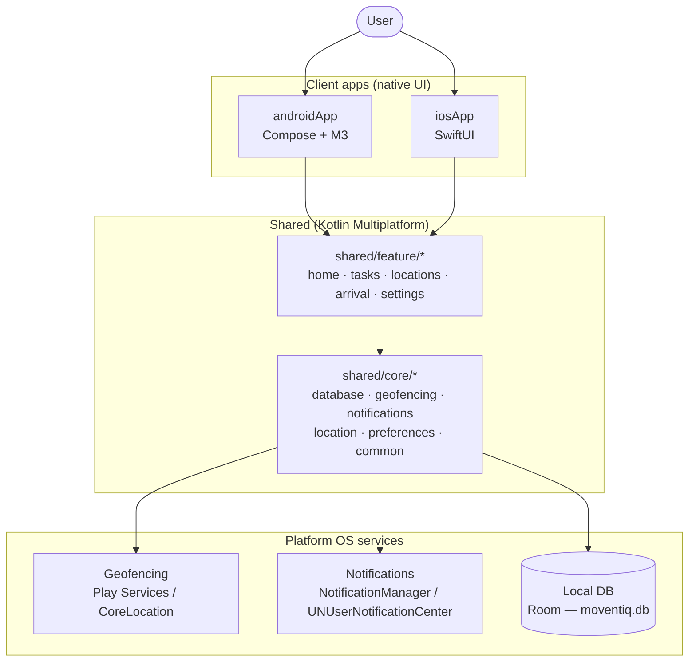
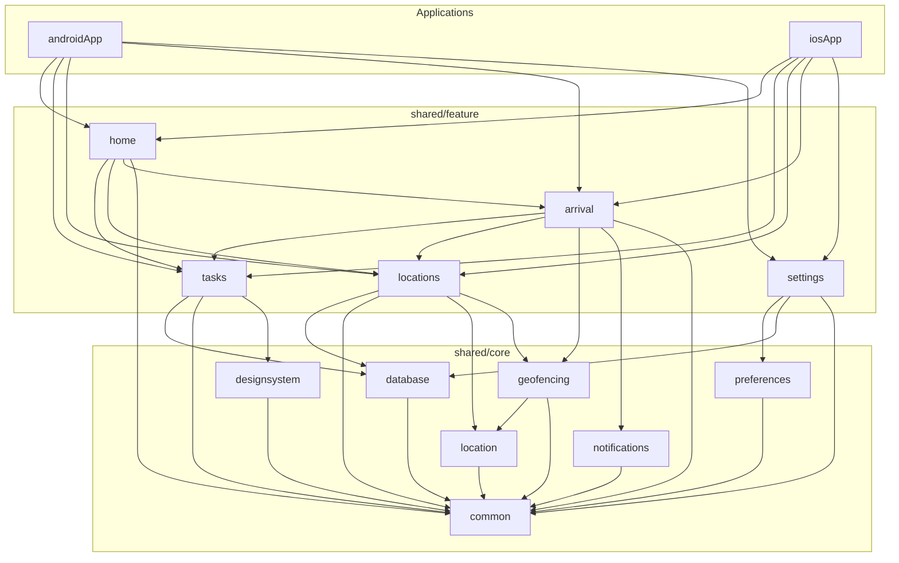
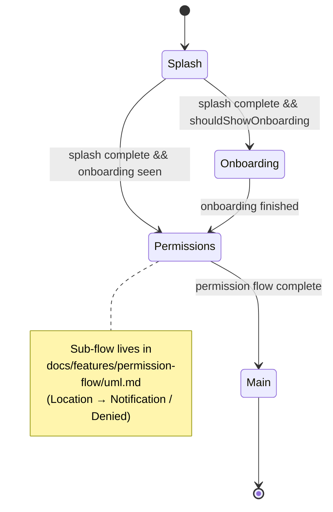
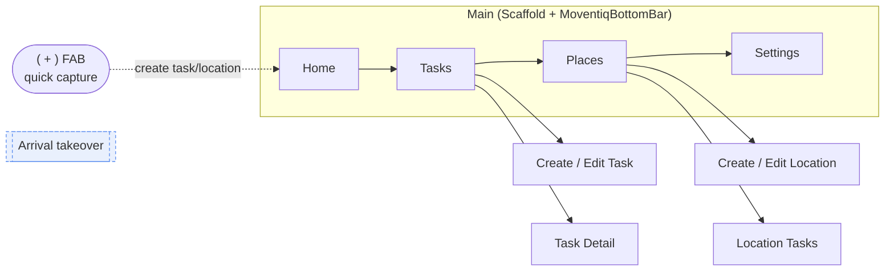
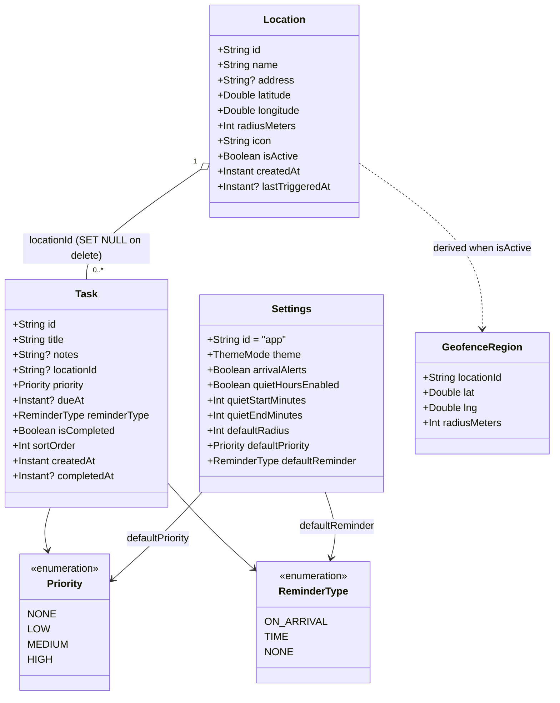
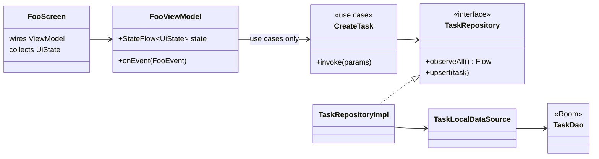
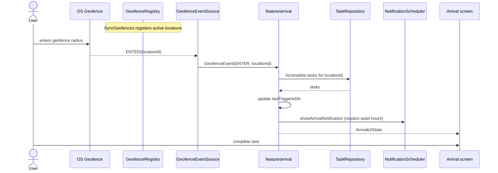
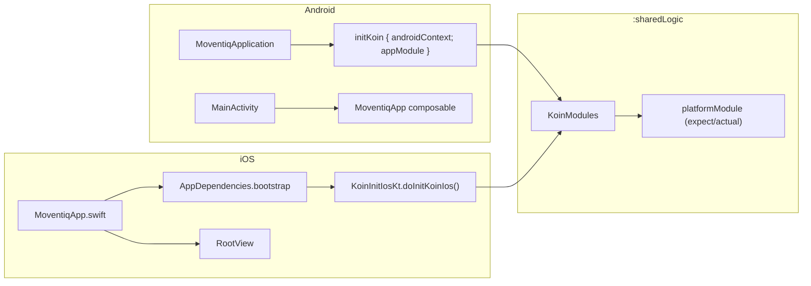

# Moventiq — System UML

> Project-wide UML. Visual specs: `Moventiq.pen` / [DESIGN.md](../../DESIGN.md). Scope: [MVP.md](../../MVP.md). Module rules & folder trees: [ARCHITECTURE.md](../../ARCHITECTURE.md). Feature-level UML lives under `docs/features/<slug>/uml.md`.

All diagrams are **Mermaid** (render in GitHub / Cursor / Android Studio Markdown preview).

## Implementation status (as of this doc)

| Area | State |
|---|---|
| Splash · Onboarding · Permission flow | ✅ implemented (Android + iOS) |
| App phase shell (`MoventiqApp`) | ✅ implemented |
| Home | 🟡 placeholder screen only |
| Tasks · Locations · Arrival · Settings | ⬜ planned (M2–M4) |
| Data layer (Room, repositories, use cases) | ⬜ planned (M1) — `:sharedLogic` holds only DI + stubs today |
| Geofencing / notifications core | ⬜ planned (M3 / M5) |

Diagrams below are labelled **(current)** when they reflect shipped code and **(target)** when they describe the planned MVP architecture.

---

## 1. System context (target)

No backend, no auth, no cloud — fully local-only for MVP.

---

## 2. Module dependency (target)

Rules (CI-enforced): acyclic graph · `domain` imports no platform/DB · features never import another feature's `data` · `core/*` never depends on `feature/*`. Full list: [ARCHITECTURE.md §3](../../ARCHITECTURE.md).

---

## 3. App phase shell — state machine (current)

Reflects `androidApp/.../MoventiqApp.kt` (`AppPhase`) and the iOS `RootView`.

Phase is **derived state**, not navigation: `MoventiqApp` computes `phase` from three ViewModels' `StateFlow`s and renders via `AnimatedContent`. `MoventiqNavHost` (Compose Navigation) only takes over inside `Main`.

---

## 4. Navigation map — Main (target)

`Arrival` is a full-screen takeover pushed on geofence ENTER, outside the tab graph. Today `MoventiqNavHost` only registers `Routes.Home` → `PlaceholderHomeScreen`.

---

## 5. Domain data model (target)

`GeofenceRegion` is **not persisted** — derived from active `Location`s and synced to the OS via `GeofenceRegistry`.

---

## 6. Clean architecture — one feature slice (target)

Reads: `DAO/Flow → repository → domain → use case → platform ViewModel → UI`. UI never imports DAOs.

---

## 7. Core loop — arrival sequence (target)

---

## 8. Platform ↔ shared bootstrap (current)

DI is Koin: shared graph in `:sharedLogic/di`; `androidApp` registers ViewModels; iOS holds a thin graph in `SharedLogic.framework`.

---

## Maintenance

- Keep diagrams labelled **(current)** in sync with shipped code; promote **(target)** sections to **(current)** as milestones land.
- New behaviour flows get their own `docs/features/<slug>/uml.md` (per `moventiq-feature-workflow`); link them here under the relevant section.
