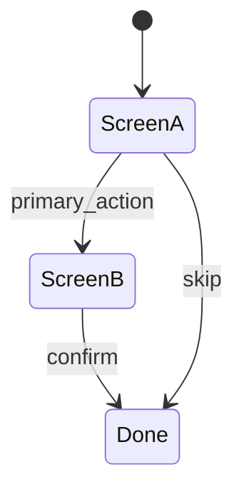
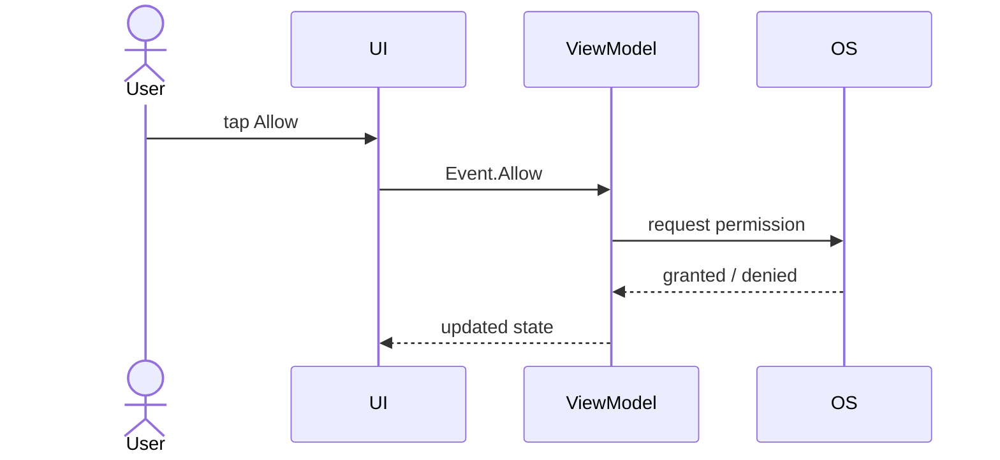
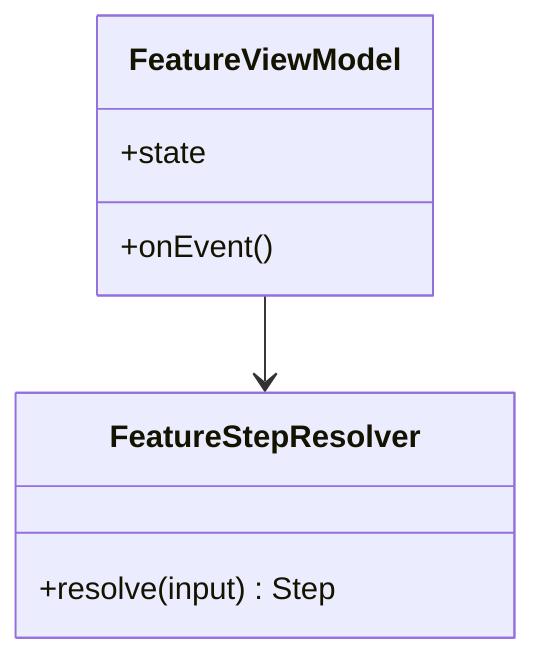

# Feature: `<feature-name>`

Status: **draft** | accepted | implemented  
Slug: `<feature-slug>`

## Summary

One paragraph: what the user can do and why it exists.

## State machine

## Sequence (optional)

## Component sketch (optional)

## Behavior cases

| # | Trigger | Same session | After background / cold start | Test layer |
|---|---|---|---|---|
| 1 | | | | unit / UI |
| 2 | | | | unit / UI |

## Persistence (if any)

| Key / field | Meaning |
|---|---|
| | |

## Platform notes

| Behavior | Android | iOS |
|---|---|---|
| | | |

## Related

- Pencil: `Moventiq.pen` — `<screen names>`
- Copy / strings: link if separate doc
