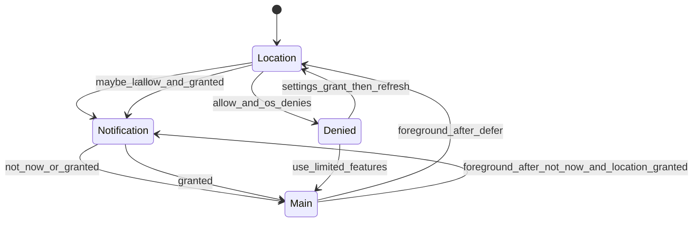
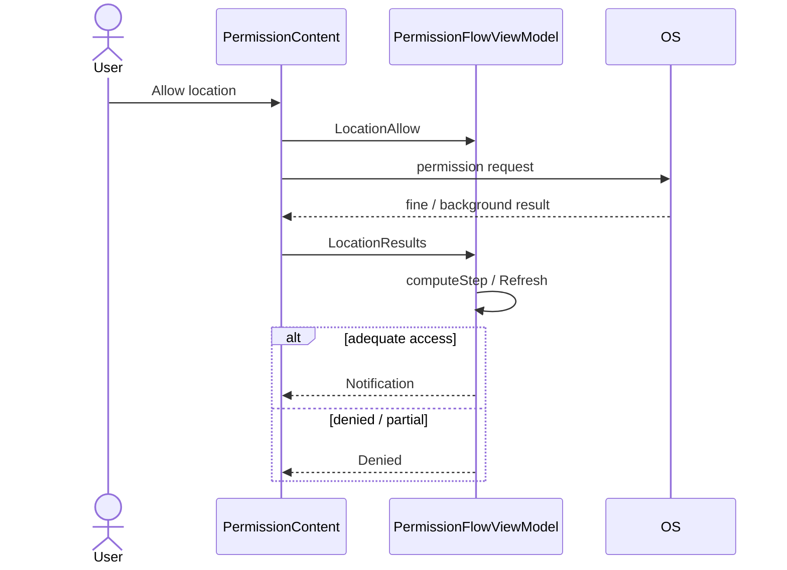
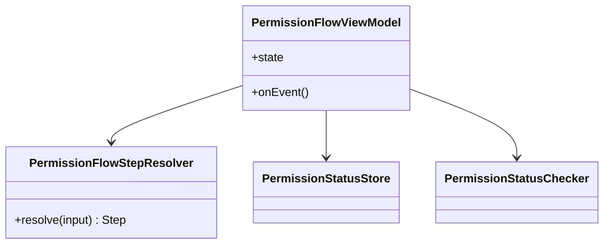

# Feature: Permission flow

Status: **implemented**  
Slug: `permission-flow`

## Summary

After onboarding, Moventiq asks for location and notification permissions with defer/skip options and a recovery screen when location is denied after Allow. Session skips reset on foreground so each page can re-prompt independently.

## State machine

## Sequence — Allow location

## Component sketch

## Behavior cases

| # | Trigger | Same session | After background | Test layer |
|---|---|---|---|---|
| 1 | Fresh install | Location | Location | unit, UI |
| 2 | Maybe later | Notification | Location | unit, UI |
| 3 | Not now (notification) | Main | Notification if location OK | unit, UI |
| 4 | Allow → OS deny | Denied | Denied | unit, UI |
| 5 | Allow → grant + refresh | Notification | Notification | unit |
| 6 | Use limited features | Main, no prompts | Main | unit, UI |
| 7 | Location granted + Not now → foreground | Main | Notification | unit |
| 8 | Maybe later + Not now → foreground | Main | Location | unit |

## Persistence

| Key | Meaning |
|---|---|
| `limited_features_acknowledged` | Permanent opt-out |
| `show_location_denied_screen` | Show recovery after Allow + deny |
| `location_allow_attempted` | User tapped Allow at least once |

## Related

- Copy / strings: `androidApp/.../res/values/strings.xml` (`permission_*`), iOS `PermissionStrings.swift`
- Test plan: [test-plan.md](./test-plan.md)
